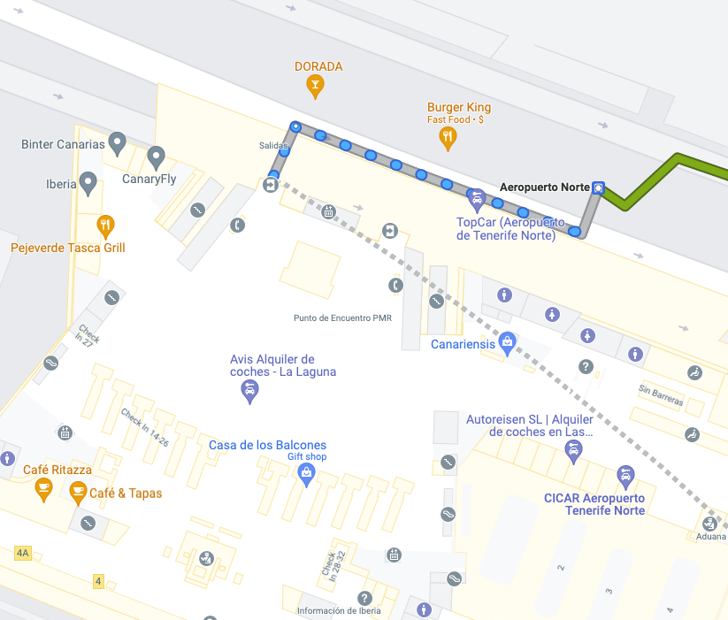
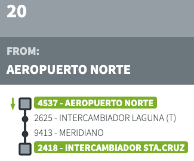

# Transport Inside Tenerife

### 7 DAYS TRAVEL CARD - 50€ 
https://www.titsa.com/index.php/en/your-buses/fares-and-discounts

## Airport

## Aeroport -> Sea Port 
- 2.65€
- From 06:00 to 00:40
- Every 30 min

## Santa Cruz - San Bernardo 8.60€ - 9.10€ 
### Intercambiador Santa Cruz - Estación Icod (T) #108
- 1:20
- 7.45€ 

### Estación Icod - San Bernardo #363
- 0:25
- 1.65€
### Intercambiador Santa Cruz - El Canario (T) #103
- 0:40
- 4.30€ 
### El Canario (T) - San Bernardo #363
- 1:10
- 4.30€ 
